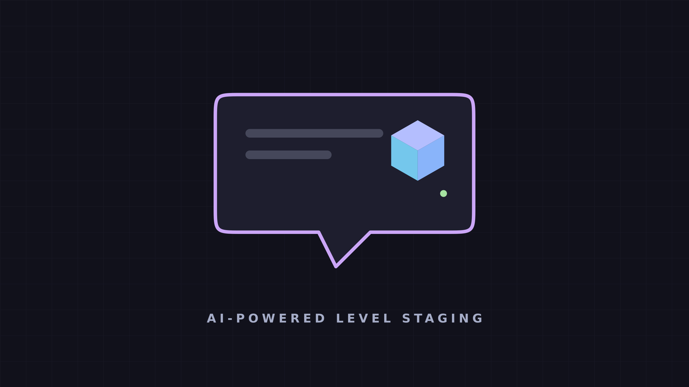

# Semantic Staging Tool



Semantic Staging Tool is a desktop 3D set-dressing and level-design prototype written in C++20. It turns a natural-language prompt into a practical arrangement of the 3D assets available in the project, then lets you inspect and refine that result directly in a real-time viewport.

The application sends the prompt, room dimensions, measurements for the loaded props, and (when applicable) the current scene to a Groq OpenAI-compatible chat-completions endpoint. The model returns a layout constrained by a strict JSON Schema. The application validates the referenced props, places floor and surface objects, keeps floor objects inside the room, resolves simple overlaps, and renders the result.

## Features

- Loads `.obj`, `.gltf`, and `.glb` models recursively from `assets/models`.
- Builds an AI prompt from the actual available assets and their bounding dimensions.
- Lets you choose between the supported Groq models in the editor.
- Uses strict JSON Schema output to prevent malformed or incomplete layout responses.
- Creates a new scene from the first prompt, or adds to the existing scene on later prompts.
- Supports floor placement and placing small assets on top of another placed asset.
- Clamps floor objects to the selected room bounds and resolves simple XZ overlaps.
- Offers a fly camera and on-screen gizmos for manual translation and Y-axis rotation.
- Exports the placed instances as JSON.

## Requirements

- CMake 3.24 or newer
- A C++20-capable compiler (GCC, Clang, or MSVC)
- Git and an internet connection for CMake to download dependencies on the first configure
- A desktop graphics environment supported by [raylib](https://www.raylib.com/)
- A Groq API key, for AI generation

CMake downloads and builds raylib, Dear ImGui/rlImGui, ImGuizmo, nlohmann/json, and CPR automatically. No manual installation of these libraries is required.

## Build

From the project root:

```bash
cmake -S . -B build -DCMAKE_BUILD_TYPE=Release
cmake --build build --config Release
```

Run the executable from the build directory so it can find the `assets` directory copied by CMake:

```bash
./build/SemanticStagingTool
```

On multi-configuration generators such as Visual Studio, the executable may instead be under `build/Release/`.

## Release checklist

Before creating a public build, decide the final contents of `assets/models`.
Every supported model below that folder is loaded and sent to the generator as
an available prop, so unused assets make releases larger and give the LLM more
irrelevant choices.

1. Test a clean scene, an incremental prompt, manual move/rotation, **Clear**,
   **Undo Prompt**, and **Export to JSON**.
2. Test with an invalid API key and without a network connection; both cases
   must show an error without closing the app.
3. Confirm that the application starts from its distribution folder and loads
   both `assets/` and `shaders/` without relying on source files.
4. Test the release package on a machine or VM that does not have the project
   checkout or your development dependencies installed.
5. Include a short `LICENSE`, a third-party notices file, a version number,
   and release notes describing the supported platforms and known limitations.

### Windows

Build from an **x64 Native Tools Command Prompt for Visual Studio**:

```powershell
cmake -S . -B build-windows -A x64
cmake --build build-windows --config Release
```

Package the contents of `build-windows/Release/` as a zip, keeping this layout:

```text
SemanticStagingTool-windows-x64/
  SemanticStagingTool.exe
  assets/
  shaders/
  <required .dll files>
  README.md
  LICENSE
```

Run the executable from the unpacked folder on a clean Windows machine. Copy
all runtime DLLs reported by Visual Studio or a dependency-inspection tool,
and install or bundle the Microsoft Visual C++ Redistributable if required.
Do not put a Groq API key in the package.

### Linux

Build on the oldest Linux distribution you intend to support:

```bash
cmake -S . -B build-linux -DCMAKE_BUILD_TYPE=Release
cmake --build build-linux --config Release -j
```

Package the executable generated in `build-linux/` together with its copied
`assets/` and `shaders/` directories:

```text
SemanticStagingTool-linux-x86_64/
  SemanticStagingTool
  assets/
  shaders/
  README.md
  LICENSE
```

Before publishing, use `ldd SemanticStagingTool` on the release binary and
test on a clean Linux installation. Document the required graphics stack and
any system libraries that you choose not to bundle. A portable AppImage or
distribution-specific `.deb`/`.rpm` can be added after the zip/tarball release
has been verified.

## Generate a scene

1. Start the application.
2. Enter a Groq API key in **API Key**. The key stays in memory only for the current run.
3. Select an **LLM model**. `openai/gpt-oss-120b` is the default quality-oriented option; `openai/gpt-oss-20b` is faster; `qwen/qwen3.8-27b` is an alternative.
4. Set the room **Width (X)** and **Depth (Z)** in metres.
5. Describe the desired setup in **Prompt**. For example: `Arrange a cosy study area with a desk, chair, lamp, books, and a bookshelf.`
6. Select **Send** and wait for the scene to appear.

The first successful request replaces the scene. Once a scene contains objects, later requests can add props or edit an existing prop by referring to its instance ID; the model receives the current positions and dimensions to resolve the requested change. Use **Clear** before sending a prompt when you want to start over.

The generator can only choose props that the application found under `assets/models`. Structural assets—such as walls, floors, ceilings, doors, windows, boards, and posters—are deliberately excluded from generated prop choices.

## Important: generated layouts are fallible

The LLM does **not** produce perfect layouts. It can frequently make poor spatial or semantic decisions, especially with crowded rooms, many similar props, incremental edits, unusual asset dimensions, or vague prompts. Typical failures include unwanted overlaps, implausible spacing, objects placed on an unsuitable surface, an inappropriate selection of props, or an arrangement that simply does not match the intended style.

Strict JSON Schema only guarantees the response structure: it does not make the model understand the scene perfectly or guarantee an aesthetically pleasing, physically realistic layout. The application applies basic bounds and overlap handling, but every generated scene should be treated as a draft. Inspect it in the viewport, use the gizmos for manual corrections, and retry with a more explicit prompt when necessary.

## Viewport controls

| Action | Control |
| --- | --- |
| Look around | Move the mouse + Right-click|
| Move forward / backward | `W` / `S` |
| Strafe right / left | `D` / `A` |
| Move up / down | `E` / `Q` |
| Move faster | Hold `Left Shift` |
| Select an object | Left-click it in the viewport |
| Use translation gizmo | Press `T` |
| Use rotation gizmo | Press `R` |

After selecting an object, drag the displayed gizmo to edit it. Rotation is stored around the vertical (Y) axis.

## Exported scene format

Select **Export to JSON** to write `saved_scene.json` to the process working directory. The export contains the final placed instances rather than the original model response:

```json
{
  "entities": [
    {
      "instance_id": "desk_01",
      "prop_id": "M_room_desk",
      "position": { "x": 1.2, "y": 0.0, "z": -2.4 },
      "rotation_y": 90.0,
      "is_static": true
    }
  ]
}
```

`prop_id` is the filename stem of the corresponding loaded model. `position` uses raylib world coordinates, and `rotation_y` is in degrees.

## Adding assets

Add supported model files anywhere below `assets/models`, then rebuild (or ensure the files are present next to the executable in its copied `assets/models` directory). The application discovers models recursively. Avoid duplicate filename stems: the stem is the asset identifier used in generation and exports.

## Credits

The 3D assets included for testing are from Kenney's [Graveyard Kit](https://kenney.itch.io/kenney-game-assets). Thank you to [Kenney](https://kenney.nl/) for making these assets available under the [CC0 1.0 Universal](https://creativecommons.org/publicdomain/zero/1.0/) license.

## License

Unless a file states otherwise, this project's source code is licensed under the [PolyForm Noncommercial License 1.0.0](LICENSE). Commercial use, including commercial distribution, requires a separate written license from the copyright holder. This is source-available software, not open source.

The testing assets under `assets/models/Graveyard` are licensed separately under CC0 1.0 and are not subject to this noncommercial restriction.

## API notes and troubleshooting

- The endpoint is configured for Groq's OpenAI-compatible API. The editor currently offers `openai/gpt-oss-120b`, `openai/gpt-oss-20b`, and `qwen/qwen3.8-27b`; a valid Groq key is required for all of them.
- Requests have a 15-second timeout. Authentication, network, and API errors are displayed in the editor panel.
- The API key is sent as a Bearer token directly to Groq; it is not saved by the application.
- If the application opens without models, make sure the executable is being run alongside the `assets` directory produced by the CMake post-build step.
- Strict JSON Schema prevents malformed or incomplete responses, but it does not guarantee a correct or attractive layout. AI output is constrained to known props; still inspect every scene and use the gizmos to make final spatial and artistic adjustments.
